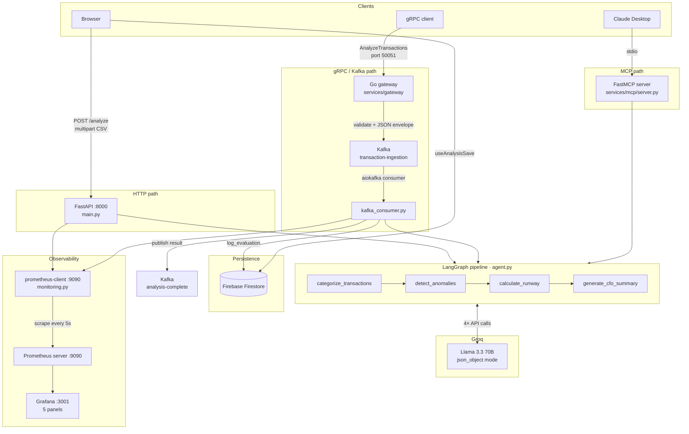

# Architecture

CPG CFO Agent has three independent ingestion paths that all feed the same LangGraph pipeline.

## System diagram



## Data flow

### HTTP path

1. The browser uploads a CSV to `POST /analyze` (multipart form).
2. `main.py` reads the CSV into pandas, computes `monthly_burn`, and builds `AgentState`.
3. `cfo_app.invoke()` runs the four LangGraph nodes in sequence.
4. FastAPI returns the result JSON in a single response.
5. `useAnalysisSave.ts` writes the result to Firestore under the user's anonymous session.
6. `monitoring.py` records `REQUEST_COUNT` and `REQUEST_LATENCY` for the `/analyze` endpoint label.

### gRPC / Kafka path

1. A gRPC client calls `AnalyzeTransactions` on the Go gateway (port 50051).
2. The gateway runs two validators (`ValidateCSV`, `ValidateSessionID`), generates a UUID job ID, and publishes a JSON envelope to `transaction-ingestion`.
3. `kafka_consumer.py` deserializes the message, reconstructs `AgentState` from `csv_data`, and calls `cfo_app.invoke()`.
4. After the pipeline completes, `evaluation.py` writes a quality-scored record to Firestore `evaluations/`.
5. The result JSON is published to `analysis-complete` keyed by `job_id`.
6. `monitoring.py` records metrics under the `kafka` endpoint label.

### MCP path

1. Claude Desktop spawns `services/mcp/server.py` as a stdio subprocess (FastMCP).
2. Three tools are registered: `analyze_transactions`, `categorize_spend`, `get_runway_forecast`.
3. Each tool call parses the CSV with `_load_csv()`, infers `monthly_revenue` from the data, then runs the relevant LangGraph nodes.
4. Results are returned as structured dicts to Claude.

## Services and ports

| Service | Port | Notes |
|---------|------|-------|
| Next.js frontend | 3000 | Dev server; production on Vercel |
| FastAPI backend | 8000 | `/analyze`, `/health`, `/docs` |
| Go gRPC gateway | 50051 | `FinancialAnalysisService.AnalyzeTransactions` |
| Kafka broker | 9092 | Confluent 7.6.0; internal hostname `kafka` in Docker Compose |
| Zookeeper | 2181 | Required by Confluent Kafka |
| prometheus-client | 9090 (container-internal) | Started by `monitoring.py` inside the backend container; scraped by Prometheus as `backend:9090` |
| Prometheus server | 9090 (host) | Prometheus UI; scrapes `backend:9090` every 5s |
| Grafana | 3001 | Dashboard auto-provisioned from `grafana/` |

## LangGraph pipeline nodes

All four nodes live in `backend/agent.py` and share a single `AgentState` TypedDict.

```
categorize_transactions
    Input:  csv_text (first 3000 chars)
    Output: categorized → {categories: {COGS: [...], OpEx: [...]}, total_by_category: {...}}
    Model:  llama-3.3-70b-versatile, json_object mode

detect_anomalies
    Input:  df_summary (pandas describe() output)
    Output: anomalies → {anomalies: [...], risk_level: "low|medium|high", actions: [...]}
    Model:  llama-3.3-70b-versatile, json_object mode

calculate_runway
    Input:  monthly_burn, monthly_revenue (pre-computed from CSV)
    Output: runway → {runway_months: float, recommendations: [...]}
    Model:  llama-3.3-70b-versatile, json_object mode

generate_cfo_summary
    Input:  categorized, anomalies, runway
    Output: summary → str (3-paragraph executive brief)
    Model:  llama-3.3-70b-versatile, free-text mode
```

Graph edges: `categorize → detect_anomalies → runway_calc → summarize → END`

## Kafka envelope schema

JSON published to `transaction-ingestion` by the Go gateway:

```json
{
  "job_id":     "uuid-v4",
  "session_id": "caller-supplied session id",
  "csv_data":   "date,amount,...\n...",
  "user_id":    "caller-supplied user id",
  "timestamp":  "2026-06-26T12:00:00Z"
}
```

JSON published to `analysis-complete` by `kafka_consumer.py`:

```json
{
  "job_id":     "uuid-v4",
  "status":     "complete | error",
  "summary":    "...",
  "categories": {...},
  "anomalies":  {...},
  "runway":     {...}
}
```

## Firestore schema

**`evaluations/{auto-id}`** — written after every Kafka-path pipeline run.

```json
{
  "job_id":           "uuid-v4",
  "input_hash":       "sha256 of csv_data",
  "agent_outputs":    {"categorized": "...", "anomalies": "...", "runway": "..."},
  "latencies_seconds": {"total_seconds": 4.2},
  "quality_score":    100,
  "quality_reasons":  [],
  "timestamp":        "2026-06-26T12:00:00+00:00"
}
```

Quality score (0–100): +40 if `summary` ≥ 100 chars; +20 each for non-empty `categorized`, `anomalies`, `runway`.

## Kubernetes topology

All workloads in namespace `cpg-cfo-agent`.

| Deployment | Replicas | HPA |
|-----------|----------|-----|
| gateway | 2 | 2–5 replicas at 70% CPU |
| backend | 2 | none |
| frontend | 1 | none |
| kafka | 1 | none |

The HPA (`k8s/hpa.yaml`) targets the `gateway` deployment. Scale-up stabilization is 30s; scale-down is 300s. Requires the Kubernetes Metrics Server.

The backend deployment exposes two container ports: `8000` (HTTP) and `9090` (metrics). The nginx Ingress routes external HTTP traffic. The gateway is exposed on port 50051 via its own Service.
