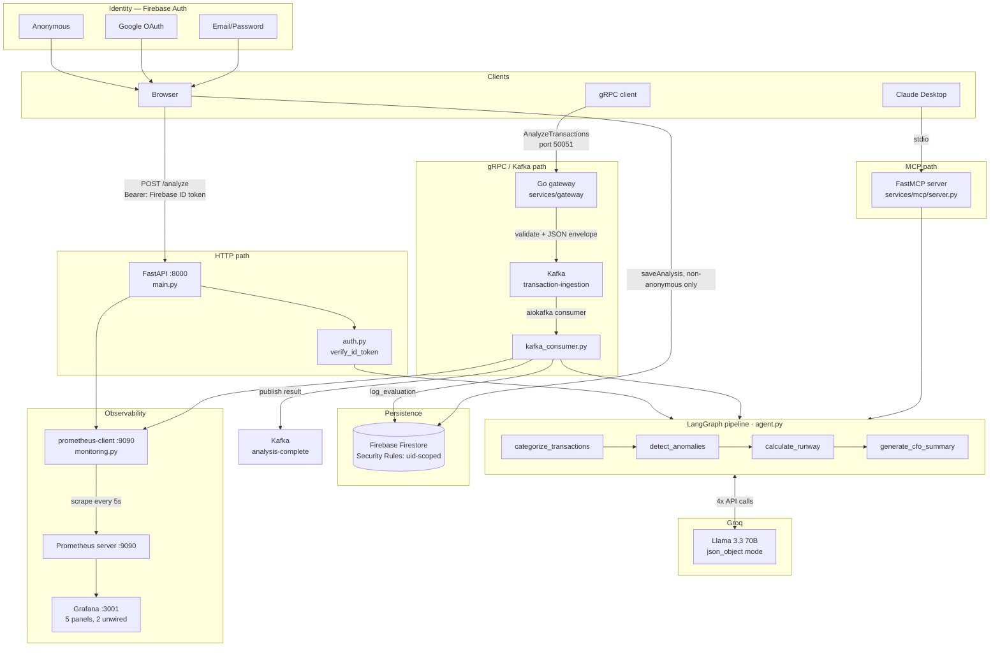

# Architecture

Baseline (repo name `cpg-cfo-agent`) has three independent ingestion paths that all feed the same LangGraph pipeline, plus a frontend auth layer that gates two of the three access patterns (browser demo, browser dashboard) without touching the pipeline itself.

## System diagram


```mermaid
flowchart TD
    subgraph clients["Clients"]
        BROWSER[Browser]
        GRPC_CLIENT[gRPC client]
        CLAUDE[Claude Desktop]
    end

    subgraph http["HTTP path"]
        BROWSER -->|POST /analyze\nBearer: Firebase ID token| API[FastAPI :8000\nmain.py]
        API --> AUTH[auth.py\nverify_id_token]
    end

    subgraph grpc["gRPC / Kafka path"]
        GRPC_CLIENT -->|AnalyzeTransactions\nport 50051| GW[Go gateway\nservices/gateway]
        GW -->|validate + JSON envelope| KIN[Kafka\ntransaction-ingestion]
        KIN -->|aiokafka consumer| KC[kafka_consumer.py]
    end

    subgraph mcp["MCP path"]
        CLAUDE -->|stdio| MCP[FastMCP server\nservices/mcp/server.py]
    end

    subgraph pipeline["LangGraph pipeline  ·  agent.py"]
        P1[categorize_transactions] --> P2[detect_anomalies]
        P2 --> P3[calculate_runway]
        P3 --> P4[generate_cfo_summary]
    end

    subgraph groq["Groq"]
        LLM[Llama 3.3 70B\njson_object mode]
    end

    AUTH --> pipeline
    KC --> pipeline
    MCP --> pipeline
    pipeline <-->|4x API calls| LLM

    subgraph identity["Identity — Firebase Auth"]
        GUEST[Anonymous]
        GOOGLE[Google OAuth]
        EMAIL[Email/Password]
    end

    GUEST --> BROWSER
    GOOGLE --> BROWSER
    EMAIL --> BROWSER

    subgraph persistence["Persistence"]
        FS[(Firebase Firestore\nSecurity Rules: uid-scoped)]
    end

    subgraph observability["Observability"]
        METRICS[prometheus-client :9090\nmonitoring.py]
        PROM[Prometheus server :9090]
        GRAFANA[Grafana :3001\n5 panels, 2 unwired]
    end

    KC -->|log_evaluation| FS
    BROWSER -->|saveAnalysis, non-anonymous only| FS
    KC -->|publish result| KOUT[Kafka\nanalysis-complete]

    API --> METRICS
    KC --> METRICS
    METRICS -->|scrape every 5s| PROM
    PROM --> GRAFANA
```

## Authentication

The full auth surface is: guest (anonymous Firebase user), Google OAuth, and email/password — all backed by one `firebase.auth.Auth` instance in `frontend/lib/firebase.ts`, and, since this session's work, a backend that actually checks the token instead of trusting whoever calls it.

### Why the backend didn't verify anything until recently

For most of this project's life, `POST /analyze` had no authentication check at all — no `Authorization` header inspection, no token verification, nothing. CORS restricted which browser origins could call it, but CORS is not an auth boundary; a direct `curl` to the Render URL worked identically to a request from the real frontend. This was a genuine gap, not a design choice, and closing it was a discrete piece of work layered on top of the existing three-provider auth system rather than a rewrite of it.

### The guest-token decision

The one design question that mattered here: if `/analyze` starts requiring a valid token, does the guest demo — the thing a recruiter clicks with zero signup friction — stop working?

The answer follows from how Firebase Anonymous Auth actually works: `signInAnonymously()` returns a completely normal ID token, signed the same way, verifiable the same way, with `token.firebase.sign_in_provider === "anonymous"` as the only tell. `firebase-admin`'s `verify_id_token()` succeeds for it exactly like it does for a Google or email/password token. So the backend can require *a* valid Firebase identity on every call to `/analyze` — closing the "anyone with `curl` and no account at all" gap — while still accepting the identity a guest already has. Nothing about the guest demo's UX changed; a signed-out visitor who clicks straight into `/demo` and runs an analysis with no prior sign-in gets an anonymous session created for them at analyze-time (in `frontend/lib/analyzeApi.ts`), then the token attaches to the request like it would for anyone else.

The alternative — leaving `/analyze` open regardless of token presence — was rejected because it doesn't fix anything; it just keeps the original gap.

### Frontend token attachment

`frontend/lib/analyzeApi.ts`'s `runAnalysis()` is the single place that calls `/analyze`, so it's also the single place that needed the token-attachment logic:

```ts
if (!auth.currentUser) {
  await signInAnon();               // on-demand, not on page load
}
const token = await auth.currentUser!.getIdToken();
// ...
headers: { Authorization: `Bearer ${token}` }
```

`getIdToken()` handles refresh transparently — Firebase ID tokens expire hourly, and the SDK re-mints one under the hood as long as the user's session is still valid, so this code doesn't need to think about expiry in the common case. A `401` response is mapped to a distinct `SessionExpiredError` so the UI can say "your session expired, refresh the page" instead of the generic "is the backend running?" message that a network failure would otherwise produce — those are different problems and deserve different error copy.

### Credential flow

Verifying an ID token needs two things: the project id (to check the token's audience) and Google's *public* signing certificates (to check the signature). It does **not** need privileged write access to anything — which is why local development only needs `FIREBASE_PROJECT_ID` in `backend/.env`, no service-account key. `backend/auth.py` supplies an explicit no-op credential (`google.auth.credentials.AnonymousCredentials`, wrapped in a small `_VerifyOnlyCredential` class) for this path — the naive assumption that `verify_id_token()` needs zero credentials at all turned out to be wrong (constructing the Admin SDK's auth client resolves Application Default Credentials regardless), so this class exists specifically to satisfy that requirement without handing local development a real key.

Production (Render) is different: a stateless host doesn't have a natural place to put a JSON file, and Render's env var UI does not handle multiline values reliably enough to trust with a private key. The chosen format is `FIREBASE_SERVICE_ACCOUNT_BASE64` — a service-account JSON, base64-encoded onto a single line:

```bash
base64 -i service-account.json | tr -d '\n'
```

`backend/auth.py` decodes it at startup and initializes the real Firebase Admin SDK with it. `.env.example` documents the resolution order: `FIREBASE_SERVICE_ACCOUNT_BASE64` (Render) → `GOOGLE_APPLICATION_CREDENTIALS` (a file path — this is what `evaluation.py` already used for its own separate Firestore writes) → `FIREBASE_PROJECT_ID` (local dev, no key needed).

### Per-user data isolation

Isolation is enforced by Firestore Security Rules, not by application code:

```
allow create: if isRealUser() && request.resource.data.userId == request.auth.uid;
allow read:   if isRealUser() && resource.data.userId == request.auth.uid;
```

where `isRealUser()` additionally requires `request.auth.token.firebase.sign_in_provider != 'anonymous'`. This means a guest's Firestore *write* attempt is rejected by the rules engine itself, independent of whatever the frontend code does or doesn't check — the frontend does still skip the save call for anonymous users (in `frontend/app/demo/page.tsx` and `app/page.tsx`), but that's a UX nicety to avoid a pointless failed request, not the actual security boundary. If that client-side check had a bug, the rules would still hold. `frontend/app/dashboard/[id]/page.tsx` additionally checks `analysis.userId === user.uid` after fetching a document — belt-and-suspenders defense in depth against a document that somehow slipped through, even though the rules should make that impossible.

### Why the redesign kept the auth logic and only touched the styling

When the landing page and `/demo` were rethemed to a dark UI, `Navbar.tsx`'s `isGoogleUser` / `isGuest` checks and its `handleSignIn` / `handleSignOut` handlers were left completely untouched — only the Tailwind classes changed. `/dashboard` and `/analyze` stayed on the original light theme (out of scope for the rebrand), so `Navbar` briefly carried a `variant="light" | "dark"` prop before the whole app went dark and the prop was removed as dead code. The auth *logic* itself never had a reason to change across any of this — it's identical across every route because the same component and the same `useAuth()` hook back every page.

## Data flow

### HTTP path

1. The browser attaches a Firebase ID token (`Authorization: Bearer <token>`) and uploads a CSV to `POST /analyze`.
2. `auth.py`'s `require_firebase_user` dependency verifies the token before any CSV parsing happens; a missing or invalid token short-circuits with a `401` and the pipeline never runs.
3. `main.py` reads the CSV into pandas, computes `monthly_burn`, and builds `AgentState`.
4. `cfo_app.invoke()` runs the four LangGraph nodes in sequence.
5. FastAPI returns the result JSON in a single response.
6. If the caller is a real (non-anonymous) user, `saveAnalysis()` writes the result to Firestore under their UID; guests skip this step.
7. `monitoring.py` records `REQUEST_COUNT` and `REQUEST_LATENCY` for the `/analyze` endpoint label.

### gRPC / Kafka path

1. A gRPC client calls `AnalyzeTransactions` on the Go gateway (port 50051).
2. The gateway runs two validators (`ValidateCSV`, `ValidateSessionID`), generates a UUID job ID, and publishes a JSON envelope to `transaction-ingestion`.
3. `kafka_consumer.py` deserializes the message, reconstructs `AgentState` from `csv_data`, and calls `cfo_app.invoke()`.
4. After the pipeline completes, `evaluation.py` writes a quality-scored record to Firestore `evaluations/`.
5. The result JSON is published to `analysis-complete` keyed by `job_id`.
6. `monitoring.py` records metrics under the `kafka` endpoint label.

This path has no Firebase ID-token concept at all — it's gRPC, not HTTP-from-a-browser, and was never in scope for the auth work. It's a genuinely separate trust boundary from the HTTP path.

### MCP path

1. Claude Desktop spawns `services/mcp/server.py` as a stdio subprocess (FastMCP).
2. Three tools are registered: `analyze_transactions`, `categorize_spend`, `get_runway_forecast`.
3. Each tool call parses the CSV with `_load_csv()`, infers `monthly_revenue` from the data, then runs the relevant LangGraph nodes.
4. Results are returned as structured dicts to Claude.

stdio means this server is only ever reachable by a process that spawns it directly on the same machine — it has never been exposed as a network-reachable service, so it has no auth story of its own and needs none.

## Design decisions

**Why LangGraph.** Financial analysis here isn't one LLM call with a big prompt — it's four narrow stages (categorize, detect anomalies, forecast runway, summarize), each with its own checkable output shape. LangGraph makes the stages explicit nodes in a state graph, so any one of them can be inspected, tested, or swapped independently, and a failure is attributable to a specific stage instead of "the LLM did something wrong somewhere in a 2000-word prompt."

**Why Firestore over a relational database.** The data model here is genuinely simple: one `analyses` collection, documents scoped by `userId`, queried with `where('userId', '==', uid)` plus an `orderBy('createdAt')`. That doesn't need a schema migration story, connection pooling, or a hosted Postgres instance — it needs per-user document isolation, which Firestore Security Rules give directly without any backend code enforcing it.

**Why Firebase Auth ID tokens instead of a custom session/JWT scheme.** The frontend was already using Firebase Auth for sign-in; verifying the *same* tokens on the backend, rather than inventing a parallel session mechanism, meant zero new moving parts on the frontend (no new login flow, no new cookie, no new refresh logic) and a well-documented, security-reviewed verification path (`firebase-admin`'s `verify_id_token`) on the backend. The guest-token carve-out described above was the one piece of this that needed actual thought rather than just wiring up a library.

**Why guest mode exists at all.** The primary evaluator of a portfolio project is not going to create an account before deciding whether to keep reading. Guest mode is the demo's entire top-of-funnel; the auth work above was explicitly designed around not breaking it.

## Frontend structure

- `app/page.tsx` — public landing page (dark theme, animated background, no auth required to view).
- `app/demo/page.tsx` — the interactive demo. Same `UploadForm` / `Dashboard` components as the authenticated `/analyze` flow, but results aren't saved for anonymous users.
- `app/analyze/page.tsx` — authenticated upload flow; results are saved to Firestore and the user is offered a link into `/dashboard`.
- `app/dashboard/page.tsx`, `app/dashboard/[id]/page.tsx` — analysis history list and detail view, both gated on `isSignedIn = !!user && !user.isAnonymous`.
- `app/login/page.tsx`, `app/signup/page.tsx` — email/password forms plus a "Continue with Google" button, both redirecting to `/dashboard` on success and away from themselves if the visitor is already signed in with a real account.
- `components/Navbar.tsx` — the one place `isGoogleUser` / `isGuest` branching lives; every page renders the same component.
- `components/ScanlinesOverlay.tsx` — the persistent background: five independently animated radial light sources (different colors, sizes, opacities, and drift durations so they never visually sync), a vignette, and a CRT scanline texture, mounted once in `app/layout.tsx` so it spans every route instead of resetting per page or per section.
- `components/landing/` — the marketing sections (Hero, Problem, Pipeline, Capabilities, Architecture, Stack, FooterCTA), each a small, focused component rather than one long page file.

## Services and ports

| Service | Port | Notes |
|---------|------|-------|
| Next.js frontend | 3000 | Dev server; production on Vercel |
| FastAPI backend | 8000 | `/analyze` (token-gated), `/health` (open), `/docs` |
| Go gRPC gateway | 50051 | `FinancialAnalysisService.AnalyzeTransactions` |
| Kafka broker | 9092 | Confluent 7.6.0; internal hostname `kafka` in Docker Compose |
| Zookeeper | 2181 | Required by Confluent Kafka |
| prometheus-client | 9090 (container-internal) | Started by `monitoring.py` inside the backend container; scraped by Prometheus as `backend:9090` |
| Prometheus server | 9090 (host) | Prometheus UI; scrapes `backend:9090` every 5s |
| Grafana | 3001 | Dashboard auto-provisioned from `grafana/` |

## LangGraph pipeline nodes

All four nodes live in `backend/agent.py` and share a single `AgentState` TypedDict. This file has been treated as a stability boundary throughout the auth and rebrand work — it was never touched, including for the two Prometheus metrics that would technically need instrumentation added inside it.

```
categorize_transactions
    Input:  csv_text (first 3000 chars)
    Output: categorized → {categories: {COGS: [...], OpEx: [...]}, total_by_category: {...}}
    Model:  llama-3.3-70b-versatile, json_object mode

detect_anomalies
    Input:  df_summary (pandas describe() output)
    Output: anomalies → {anomalies: [...], risk_level: "low|medium|high", actions: [...]}
    Model:  llama-3.3-70b-versatile, json_object mode

calculate_runway
    Input:  monthly_burn, monthly_revenue (pre-computed from CSV)
    Output: runway → {runway_months: float, recommendations: [...]}
    Model:  llama-3.3-70b-versatile, json_object mode

generate_cfo_summary
    Input:  categorized, anomalies, runway
    Output: summary → str (3-paragraph executive brief)
    Model:  llama-3.3-70b-versatile, free-text mode
```

Graph edges: `categorize → detect_anomalies → runway_calc → summarize → END`

## Kafka envelope schema

JSON published to `transaction-ingestion` by the Go gateway:

```json
{
  "job_id":     "uuid-v4",
  "session_id": "caller-supplied session id",
  "csv_data":   "date,amount,...\n...",
  "user_id":    "caller-supplied user id",
  "timestamp":  "2026-06-26T12:00:00Z"
}
```

JSON published to `analysis-complete` by `kafka_consumer.py`:

```json
{
  "job_id":     "uuid-v4",
  "status":     "complete | error",
  "summary":    "...",
  "categories": {...},
  "anomalies":  {...},
  "runway":     {...}
}
```

## Firestore schema

**`analyses/{auto-id}`** — written by the HTTP path for signed-in (non-anonymous) users only.

```json
{
  "fileName":  "sample_transactions.csv",
  "summary":   "...",
  "categories": {...},
  "anomalies": {...},
  "runway":    {...},
  "metrics":   {...},
  "userId":    "firebase-uid",
  "createdAt": "server timestamp"
}
```

Gated entirely by the Security Rules described above — `userId` on write must equal `request.auth.uid`, and the caller's sign-in provider must not be `anonymous`.

**`evaluations/{auto-id}`** — written after every Kafka-path pipeline run, unrelated to the per-user auth system above (this is server-side logging via a service account, not a per-user document).

```json
{
  "job_id":           "uuid-v4",
  "input_hash":       "sha256 of csv_data",
  "agent_outputs":    {"categorized": "...", "anomalies": "...", "runway": "..."},
  "latencies_seconds": {"total_seconds": 4.2},
  "quality_score":    100,
  "quality_reasons":  [],
  "timestamp":        "2026-06-26T12:00:00+00:00"
}
```

Quality score (0–100): +40 if `summary` ≥ 100 chars; +20 each for non-empty `categorized`, `anomalies`, `runway`.

## Deployment architecture

| Environment | Frontend | Backend | Notes |
|---|---|---|---|
| Local dev | `npm run dev` (port 3000) | `uvicorn --reload` (port 8000) | `FIREBASE_PROJECT_ID` only — no service-account key needed to verify tokens |
| Docker Compose | Same container as prod build | Same image as prod, plus Kafka/gateway/Prometheus/Grafana | Full stack, one command |
| Production | Vercel | Render (free tier) | Two independent deploy targets, no shared infra |

**Render specifics worth knowing:** the free tier sleeps after ~15 minutes idle, so the first request after a gap has a 30–60 second cold-start cost — expected, not a bug. Render also defaults to a newer Python than this project's `pandas` version can build from source; a `PYTHON_VERSION` env var (or `.python-version` file) pinning 3.11 is required, not optional. Deploying the auth-verification change specifically required a two-step rollout: set `FIREBASE_SERVICE_ACCOUNT_BASE64` and let the *frontend* deploy first (sending tokens the old backend simply ignores), then deploy the backend that starts requiring them — reversing that order would have produced a window where the live demo 401s against a frontend that hadn't shipped the token-attachment code yet.

## Kubernetes topology

All workloads in namespace `cpg-cfo-agent`. **Structurally validated, never applied to a live cluster** — no context is even configured locally.

| Deployment | Replicas | HPA |
|-----------|----------|-----|
| gateway | 2 | 2–5 replicas at 70% CPU |
| backend | 2 | none |
| frontend | 1 | none |
| kafka | 1 | none |

The HPA (`k8s/hpa.yaml`) targets the `gateway` deployment. Scale-up stabilization is 30s; scale-down is 300s. Requires the Kubernetes Metrics Server.

The backend deployment exposes two container ports: `8000` (HTTP) and `9090` (metrics). The nginx Ingress routes external HTTP traffic. The gateway is exposed on port 50051 via its own Service.
