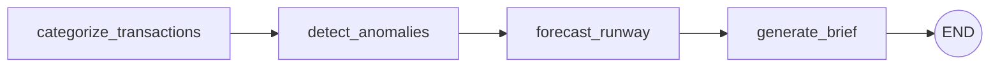
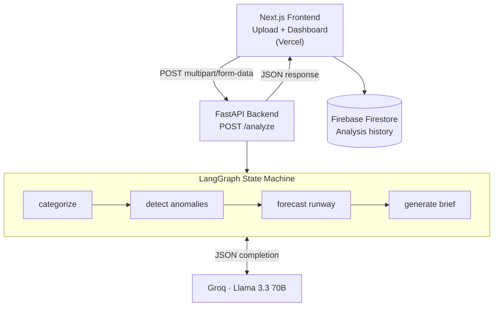

# CPG CFO Agent

**Turn a CSV of transactions into an executive financial brief in under 3 seconds.**

An agentic AI system that runs four autonomous LLM-powered agents in sequence — categorizing spend, flagging anomalies, forecasting runway, and writing a CFO-ready summary — orchestrated with LangGraph and served over a production Next.js interface.

[](LICENSE)
[](https://cpg-cfo-agent.vercel.app)
[](https://nextjs.org)
[](https://langchain-ai.github.io/langgraph/)

---

## What it does

Upload a CSV of financial transactions and the system runs a four-agent pipeline that produces a structured CFO executive brief — including categorized spend by bucket (COGS, OpEx, S&M, R&D), flagged anomalies with risk level, cash runway in months, and a plain-English executive summary written by Llama 3.3 70B.

Each agent writes to shared state that the next agent reads from. Results are persisted to Firebase Firestore and rendered in a real-time dashboard — no page reload required.

---

## Key features

- **Agentic orchestration** — Four LLM agents chained as a directed state graph via LangGraph. Each agent specializes in one task and hands structured output to the next.
- **Groq-accelerated inference** — Llama 3.3 70B served via Groq's inference API. JSON-mode responses keep outputs structured and parseable.
- **Real-time dashboard** — Upload → analysis → results rendered in one page transition. Metric cards, anomaly list, recommendations, and the full executive brief.
- **Firebase persistence** — Anonymous auth and Firestore storage so analysis history survives page refreshes.

---

## How it works

```
CSV Upload  ──►  Categorize  ──►  Detect Anomalies  ──►  Forecast Runway  ──►  Generate Brief
                    │                   │                       │                     │
             Buckets spend         Flags outliers,        Calculates burn       Writes CFO
             into COGS/OpEx/       assigns risk level     rate & runway         executive
             S&M/R&D/Other         (Low/Med/High)         in months             summary
```

**LangGraph state machine:**



**Full system architecture:**



---

## Tech stack

| Layer | Technology | Role |
|-------|-----------|------|
| Frontend | Next.js 16 + TypeScript | UI, upload form, results dashboard |
| Styling | Tailwind CSS 4 | Design system |
| Backend | FastAPI + Uvicorn | REST API, agent runner |
| Orchestration | LangGraph 0.2 | Agent state graph |
| LLM | Groq · Llama 3.3 70B | Inference (JSON mode) |
| Auth & Storage | Firebase Firestore | Anonymous auth, persistence |
| Containerization | Docker + Docker Compose | Local development |
| Deployment | Vercel | Production hosting |

---

## Quick start

**Prerequisites:** Docker Desktop, a [Groq API key](https://console.groq.com), and a [Firebase project](https://console.firebase.google.com) with Firestore enabled.

**1. Clone**

```bash
git clone https://github.com/gaurannggg7/cpg-cfo-agent.git
cd cpg-cfo-agent
```

**2. Configure environment**

`backend/.env`:

```env
GROQ_API_KEY=your_groq_api_key_here
```

`frontend/.env.local`:

```env
NEXT_PUBLIC_API_URL=http://localhost:8000
NEXT_PUBLIC_FIREBASE_API_KEY=...
NEXT_PUBLIC_FIREBASE_AUTH_DOMAIN=your_project.firebaseapp.com
NEXT_PUBLIC_FIREBASE_PROJECT_ID=your_project
NEXT_PUBLIC_FIREBASE_STORAGE_BUCKET=your_project.appspot.com
NEXT_PUBLIC_FIREBASE_MESSAGING_SENDER_ID=...
NEXT_PUBLIC_FIREBASE_APP_ID=...
```

**3. Start with Docker Compose**

```bash
docker-compose up --build
```

| Service | URL |
|---------|-----|
| Frontend | http://localhost:3000 |
| Backend | http://localhost:8000 |
| API docs | http://localhost:8000/docs |

**4. Try it**

Upload the included `sample_transactions.csv` from the web UI, or call the API directly:

```bash
curl -X POST http://localhost:8000/analyze \
  -F "file=@sample_transactions.csv" \
  -F "monthly_revenue=100000"
```

---

## Live demo

**[cpg-cfo-agent.vercel.app](https://cpg-cfo-agent.vercel.app)**

Upload the included `sample_transactions.csv` to see a full analysis. The CSV must include these columns: `date`, `amount`, `description`, `category`.

---

## Project structure

```
cpg-cfo-agent/
├── backend/
│   ├── agent.py            # LangGraph state machine + 4 agent nodes
│   ├── main.py             # FastAPI app, /analyze endpoint
│   ├── requirements.txt
│   └── Dockerfile
├── frontend/
│   ├── app/
│   │   ├── page.tsx        # Main page — state orchestrator
│   │   ├── layout.tsx
│   │   └── globals.css
│   ├── components/
│   │   ├── Dashboard.tsx   # Results view (brief, metrics, anomalies)
│   │   ├── UploadForm.tsx  # File upload + revenue input
│   │   └── landing/        # Marketing landing page sections
│   │       ├── Hero.tsx
│   │       ├── Stats.tsx
│   │       ├── HowItWorks.tsx
│   │       ├── BuiltWith.tsx
│   │       └── Footer.tsx
│   ├── hooks/
│   │   └── useAnalysisSave.ts
│   ├── lib/
│   │   └── firebase.ts
│   └── package.json
├── docker-compose.yml
├── sample_transactions.csv
└── README.md
```

---

## API reference

### `POST /analyze`

**Request:** `multipart/form-data`

| Field | Type | Description |
|-------|------|-------------|
| `file` | `File` | CSV with columns: `date`, `amount`, `description`, `category` |
| `monthly_revenue` | `number` | Revenue baseline for runway calculation |

**Response:** `application/json`

```json
{
  "summary": "Executive brief text...",
  "metrics": {
    "total_transactions": 142,
    "total_spend": 84230.00,
    "avg_transaction": 593.17
  },
  "anomalies": {
    "anomalies": ["Unusually large payment to vendor X on 2024-03-15"],
    "risk_level": "Medium"
  },
  "runway": {
    "runway_months": 4.2,
    "recommendations": ["Reduce discretionary OpEx by 15%"]
  }
}
```

---

## License

MIT

---

<div align="center">

Built by **[Gaurang Mohan](https://github.com/gaurannggg7)** · ASU CS 2026

[GitHub](https://github.com/gaurannggg7/cpg-cfo-agent) · [Live Demo](https://cpg-cfo-agent.vercel.app) · [LinkedIn](https://linkedin.com/in/gaurang-mohan)

</div>
